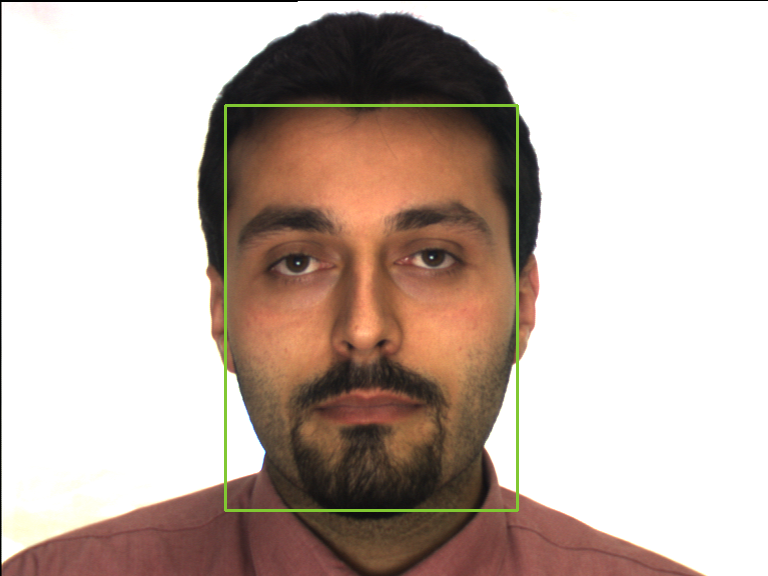
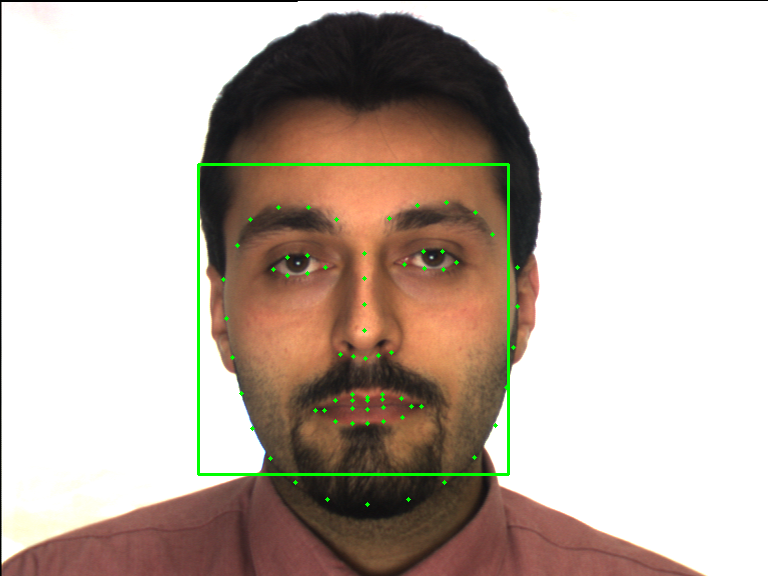
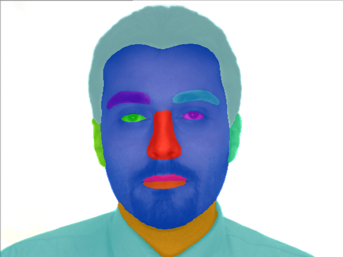
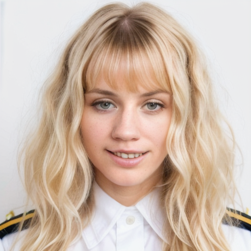
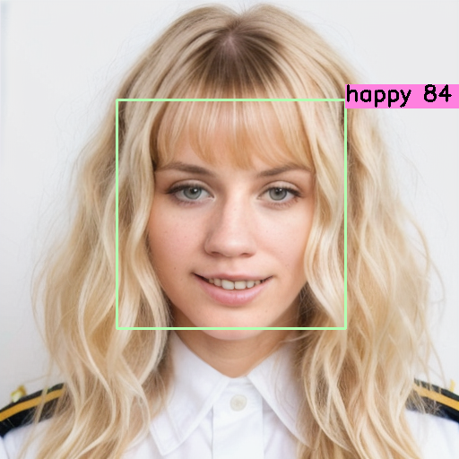
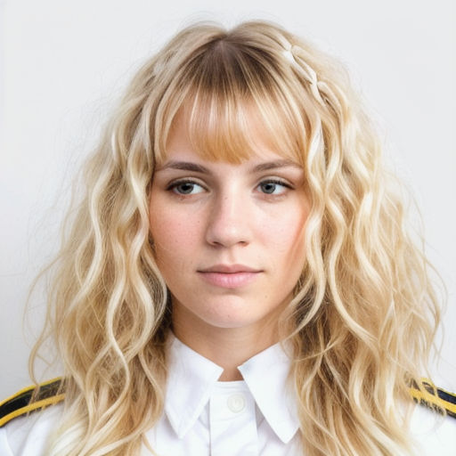
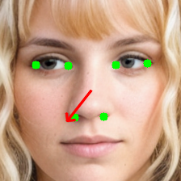

<div align="center">
  
</div>

## BioGaze: Face Image Analysis Software for ISO/ICAO Compliance Verification

**BioGaze** is an advanced face image analysis software that combines state-of-the-art AI models with computer vision techniques to rigorously verify compliance with ISO/ICAO standards. Developed in collaboration with the [BioLab at the University of Bologna](https://miatbiolab.csr.unibo.it/), BioGaze aims to provide an automated, accurate, and reliable solution for assessing facial image quality according to international standards, often required for official documentation like passports and ID cards.

### Key Features

- **Comprehensive Quality Assessment**: BioGaze performs in-depth image quality checks including **subject requirements** (gaze in camera, neutral expression, ...), **photographic requirements** (correct exposure, saturation, ...) and **acquisition requirements** (uniform background, face illumination, ...).
- **AI Model Integration**: By leveraging models from various computer vision domains such as landmark detection, head pose estimation, gaze estimation, and emotion recognition, BioGaze performs detailed checks on facial attributes and image quality.
- **Detailed Analysis and Reporting**: BioGaze offers comprehensive feedback on the analysis performed, providing users with detailed insights into any issues identified in the image. These feedbacks are present both in verbal and tabular form.

### Development and Testing

BioGaze was developed and refined in collaboration with the University of Bologna's BioLab, using the [BioLab benchmark](https://biolab.csr.unibo.it/fvcongoing/UI/Form/BenchmarkAreas/BenchmarkAreaFICV.aspx) to develop and validate its methods. Final testing was conducted on the [TONO dataset](https://miatbiolab.csr.unibo.it/tono-synthetic-dataset/), enabling the software to be optimized for high performance on a diverse set of facial images.

This open-source project aims to provide a robust, accessible tool for professionals and researchers seeking an automated solution for face image quality analysis and compliance verification. With its rigorous approach and AI-enhanced functionalities, BioGaze sets a new standard in face image compliance assessment.

---

## Requirements Verified

<div align="center">

<table>
  <thead>
    <tr>
      <th style="background-color: black; color: white; padding: 8;">Subject</th>
      <th style="background-color: black; color: white; padding: 8;">Photographic</th>
      <th style="background-color: black; color: white; padding: 8;">Acquisition</th>
    </tr>
  </thead>
  <tbody>
    <tr>
      <td>Head without covering</td>
      <td>Correct exposure</td>
      <td>Uniform background</td>
    </tr>
    <tr>
      <td>Gaze in camera</td>
      <td>In focus photo</td>
      <td>Uniform face lighting</td>
    </tr>
    <tr>
      <td>No/light makeup</td>
      <td>Correct saturation</td>
      <td>No pixelation</td>
    </tr>
    <tr>
      <td>Neutral expression</td>
      <td>Proper face dimension</td>
      <td>No posterization</td>
    </tr>
    <tr>
      <td>No sunglasses</td>
      <td></td>
      <td></td>
    </tr>
    <tr>
      <td>Eyes open</td>
      <td></td>
      <td></td>
    </tr>
    <tr>
      <td>Frontal Pose</td>
      <td></td>
      <td></td>
    </tr>
  </tbody>
</table>

</div>


### Core Tasks

BioGaze performs face quality analysis based on three essential tasks, each contributing to ICAO and ISO standard compliance:

1. **Face Detection** - Locates and isolates faces within images.
2. **Landmark Detection** - Identifies key facial features, such as the eyes, nose, and mouth.
3. **Face Parsing** - Segments facial regions to analyze structural qualities of the face.

<div align="center">
  
  
  
  
</div>

<p align="center">
  Base Image &nbsp;&nbsp;&nbsp;&nbsp; | &nbsp;&nbsp;&nbsp;&nbsp; Face Detection &nbsp;&nbsp;&nbsp;&nbsp; | &nbsp;&nbsp;&nbsp;&nbsp; Landmark Detection &nbsp;&nbsp;&nbsp;&nbsp; | &nbsp;&nbsp;&nbsp;&nbsp; Face Parsing
</p>


---

### Additional AI Models

To further enhance analysis, BioGaze integrates several AI models:

1. **Gaze Estimation** - Determines if the gaze is directed towards the camera.
2. **Emotion Recognition** - Identifies the emotional expression, ensuring compliance with a neutral expression.
3. **Head Pose Estimation** - Assesses the orientation of the face for frontal pose requirements.

<div align="center">
  
  
</div>
<div align="center">
  
  
</div>

---

## How to Install

1. **Clone the Repository**

  First, clone the BioGaze repository from GitHub:

  ```bash
    git clone https://github.com/Maphoz/BioGaze.git
    cd BioGaze
  ```

2. **Install Dependencies**

  Install the required Python packages as specified in the requirements.txt file:

  ```bash
    pip install -r requirements.txt
  ```

## How to Use

### quality_analysis.py

The `quality_analysis.py` script performs a comprehensive analysis on all checks for an individual image or an entire directory of images. It generates detailed results and summary files, providing both individual and overall performance metrics for image quality and compliance.

#### Usage

```bash
python quality_analysis.py -i <input_path> [-o <output_path>]
```

- **Required Argument**:
  - `-i`, `--input`: Path to a single image or a directory containing multiple images to be analyzed.

- **Optional Argument**:
  - `-o`, `--output`: Specify a path for the output file where the detailed results will be saved. If not provided, the default file `verbose_result.txt` will be created in the current directory.

#### Output Files

1. **Verbose Analysis** (`verbose_result.txt` or specified output path): 
   - A detailed summary of the analysis, listing how many images met the requirements and how many did not.
   - Provides feedback on any specific requirements that were not met, along with suggestions or notes for improvement.

2. **Tabulated Results** (`table_results.txt`):
   - A structured table listing all control checks performed, along with important metrics for each image, such as **IED** (Inter-Eye Distance) and **Yaw**, **Pitch**, and **Roll** (pose metrics)

---

### face_tool.py

The `face_tool.py` script enables processing of face images by running face detection, landmark recognition, and face parsing on a specified image file or directory of images. Each of these tasks can be performed individually, and results can be saved to an output directory if specified, otherwise they get saved in predefined directories within each task's folder.

#### Usage

```bash
python face_tool.py -i <input_path> [-d] [-l] [-p] [-o <output_path>]
```

- **Required Arguments**:
  - `-i`, `--input`: Path to an image file or directory containing images.

- **Optional Arguments**:
  - `-d`, `--detect`: Perform face detection.
  - `-l`, `--landmark`: Perform landmark detection.
  - `-p`, `--parse`: Perform face parsing.
  - `-o`, `--output`: Specify an optional output path to save processed images. If not provided, processed images are saved in the default directory.

---

### specific_checks.py

The `specific_checks.py` script allows you to perform specific checks on an image to evaluate various quality and compliance standards. You can specify which checks to run using a list of integers corresponding to different checks or write `all` to run all available checks.

#### Usage

```bash
python specific_checks.py -i <image_path> -c <checks_list>
```

- **Required Arguments**:
  - `-i`, `--input`: Path to the image file for analysis.
  - `-c`, `--checks`: A list of integers representing checks to perform (e.g., `0 2 6 7`) or the option `all` to perform all checks.

- **Optional Argument**:
  - `--list-checks`: Use this flag to display all available checks and their descriptions.

#### Available Checks

You can view a list of available checks by running:

```bash
python specific_checks.py --list-checks
```

This will display all checks with their corresponding IDs, such as `HEAD_WITHOUT_COVERING`, `EYES_OPEN`, etc.

#### Output

After execution, the script provides a result for each specified check, indicating if the image meets each respective criterion.

---

